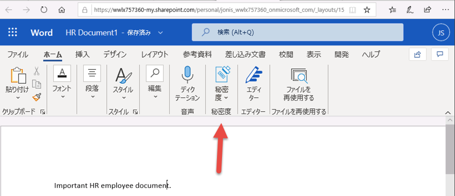

# 演習 5 - 秘密度ラベルを管理する

このラボでは、Contoso Ltd. のシステム管理者である Joni Sherman のロールを実行します。 
組織はドイツのレドニッツヘムバッハに拠点を置いており、現在、人事部のすべての従業員ドキュメントが組織の情報保護ポリシーの一部として秘密度ラベルが付けてあることを確認するための秘密度計画を実施しています。

### タスク 1 秘密度ラベルのサポートを有効にする

このタスクでは、MSOnline モジュールと SharePoint Online PowerShell モジュールをインストールし、テナントでの秘密度ラベルのサポートを有効にします。

1. Client 1 VM (LON-CL1) に **lon-cl1\admin** アカウントでログインします。

2. マウスの右ボタンでスタート メニューを選択して管理者特権で PowerShell ウィンドウを開き、**Windows PowerShell** を選択して管理者として実行します。

3. **ユーザー アカウント制御** ウィンドウで **「はい」** をクリックして確認し、Enter キーを押します。

4. 次のコマンドレットを入力して、最新の MS Online PowerShell モジュール バージョンをインストールします。

    Install-Module -Name MSOnline

5. 「信頼されていないリポジトリ セキュリティ」ダイアログの「はい」の **Y** を入力して確認し、Enter キーを押します。

6. 次のコマンドレットを入力して、最新の SharePoint Online PowerShell モジュール バージョンをインストールします。

    Install-Module -Name Microsoft.Online.SharePoint.PowerShell

7. 「信頼されていないリポジトリ セキュリティ」ダイアログの「はい」の **Y** を入力して確認し、Enter キーを押します。

8. 次のコマンドレットを入力して、MS Online サービスに接続します。

    Connect-MsolService

9. **「アカウントにサインイン」** フォームで、**Joni Sherman** JoniS@WWLxZZZZZZ.onmicrosoft.com (ZZZZZZ はラボ ホスティング プロバイダーから支給された固有のテナント ID) としてサインインします。  Joni のパスワードは、ラボ ホスティング プロバイダーから支給されます。

10. サインイン後、PowerShell ウィンドウを選択します。

11. 次のコマンドレットを入力して、ドメインを取得します。

    $domain = get-msoldomain

12. 次のコマンドレットを入力して、SharePoint 管理 URL を作成します。

    $adminurl = "https://" + $domain.Name.split('.')[0] + "-admin.sharepoint.com"

13. 次のコマンドレットを入力して、SharePoint Online 管理センターにサインインします。

    Connect-SPOService -url $adminurl

14. **「アカウントにサインイン」** フォームで、**MOD Administrator**. admin@WWLxZZZZZZ.onmicrosoft.com (ZZZZZZ はラボ ホスティング プロバイダーから支給された固有のテナント ID) としてサインインします。  管理者のパスワードは、ラボ ホスティング プロバイダーから支給されます。

15. サインイン後、PowerShell ウィンドウを選択します。

16. 次のコマンドレットを入力して、秘密度ラベルのサポートを有効にします。

    Set-SPOTenant -EnableAIPIntegration $true

17. 「はい」の **Y** を入力して確認し、Enter キーを押します。 

18. PowerShell ウィンドウを閉じます。

これで、Teams および SharePoint サイトでの秘密度ラベルのサポートが有効になりました。

### タスク 2 – 秘密度ラベルを作成する

このタスクでは、人事部が HR 従業員ドキュメントに適用する秘密度ラベルを要求しています。内部ドキュメントの秘密度ラベルと人事部のサブラベルを作成します。

1. Client 1 VM (LON-CL1) に **lon-cl1\admin** アカウントでログインしておきます。

2. **Microsoft Edge** で、**https://compliance.microsoft.com** に移動し、**Joni Sherman** JoniS@WWLxZZZZZZ.onmicrosoft.com (ZZZZZZ はラボ ホスティング プロバイダーから提供された固有のテナント ID) としてコンプライアンス センターにログインします。  Joni のパスワードは、ラボ ホスティング プロバイダーから支給されます。

3. **コンプライアンス センター**の左側のナビゲーション ウィンドウで、**「...すべて表示」** を選択し、**「情報保護」** を選択します。  

4. 「情報保護」ページで **「+ ラベルの作成」** を選択します。

5. **「新しい秘密度ラベル」** ウィザードが起動します。**「名前と説明」** ページで、**「名前」**、**「管理者向けの説明」**、**「ユーザー向けの説明」** に次の情報を入力します。

	- **名前**: 内部
	- **表示名**: 内部
	- **ユーザー向けの説明**: 内部の秘密度ラベル。
	- **管理者向けの説明**: 内部の秘密度ラベル。

6. **「次へ」** をクリックします。

7. **「このラベルのスコープを定義」** ページで、**「ファイルと電子メール」** オプションを選択します。

8. **「次へ」** をクリックします。

9. **「ファイルと電子メールの保護設定を選択」** ページで、**「次へ」** をクリックします。

10. **「ファイルと電子メールの自動ラベル付け」** ページで、**「次へ」** をクリックします。

11. **「グループとサイトの保護設定を選択」** ページで、**「次へ」** をクリックします。

12. **「データベースの列の自動ラベル付け」** ページで、**「次へ」** をクリックします。 

13. **「完了」** ページで、**「ラベルの作成」** を選択します。

14. ラベルが作成され、完了すると次のメッセージが表示されます。**ラベルが作成されました**

15. **「完了」** を選択します。

16. 「情報保護」ページで、新しく作成した **「内部」** ラベルを (選択せずに) 強調表示し、**...** を選択します。

17. ドロップダウン メニューで **「+ サブ ラベルの追加」** を選択します。

18. **「新しい秘密度ラベル」** ウィザードが起動します。**「名前と説明」** ページで、**「名前」**、**「管理者向けの説明」**、**「ユーザー向けの説明」** に次の情報を入力します。

   - **名前**: 従業員データ (HR)
   - **表示名**: 従業員データ (HR)
   - **ユーザー向けの説明**: この HR ラベルは、人事部門で指定されたすべてのドキュメントの既定のラベルです。
   - **管理者向けの説明**: このラベルは Jones さん (人事部長) と相談して作成します。ラベルの設定を変更したいときは、Jones さんに連絡します。

19. **「次へ」** をクリックします。

20. **「スコープ」** ​ページで、**「ファイルと電子メール」** オプションを選択します。

21. **「次へ」** をクリックします。

22. **「ファイルと電子メール」** ページで、**「ファイルと電子メールを暗号化」** オプションを選択します

23. **「次へ」** をクリックします。

24. **「暗号化設定の構成」** を選択します。

25. 暗号化設定に次の情報を入力します。

   - **アクセス許可を今すぐ割り当てますか、それともユーザーが決定するようにしますか?**: アクセス許可を今すぐ割り当てる
   - **コンテンツに対するユーザーのアクセス許可の期限**: なし
   - **オフライン アクセスを許可する**: 数日のみ
   - **ユーザーがコンテンツへオフラインでアクセスできる日数**: 15

26. **「アクセス許可の割り当て」** リンクを選択します

27. 「アクセス許可の割り当て」サイド メニューで、**「任意の認証済みユーザーを追加」** を選択します。

28. **「保存」** を選択します。

29. **「暗号化」** ページで **「次へ」** を選択します。

30. **「自動ラベル付け」** ページで **「次へ」** を選択します。

31. **「グループとサイト」** ページで **「次へ」** を選択します。

32. **「Azure Purview アセット (プレビュー)」** ページで **「次へ」** を選択します。 

33. **「完了」** ページで、**「ラベルの作成」** を選択します。

34. ラベルが作成され、完了すると **「ラベルが作成されました」** というメッセージが表示されます。

35. **「完了」** を選択します。

組織の内部ポリシーの秘密度ラベルと、人事 (HR) 部門の秘密度サブラベルが正常に作成されました。

### タスク 3 – 秘密度ラベルを発行する

次に、内部と人事の秘密度ラベルを発行します。これにより、発行された秘密度ラベルを人事ユーザーが人事ドキュメントに適用できるようになります。

1. Client 1 VM (LON-CL1) には **lon-cl1\admin** アカウントでログインし、Microsoft 365 には **Joni Sherman** としてログインしておく必要があります。  JoniS@WWLxZZZZZZ.onmicrosoft.com (ZZZZZZ はラボ ホスティング プロバイダーから支給された固有のテナント ID) としてサインインします。  Joni のパスワードは、ラボ ホスティング プロバイダーから支給されます。

2. **Microsoft Edge** で、「Office 365 コンプライアンス センター」タブを開いておく必要があります。そうなっている場合は、それを選択し、次の手順に進みます。閉じてしまった場合は、新しいタブで **https://compliance.microsoft.com** に移動します。

3. **コンプライアンス センター**の左側のナビゲーション ウィンドウで、**「...すべて表示」** を選択し、**「情報保護」** を選択します。 

4. **「情報保護」** ページで **「ラベルの発行」** を選択します。

5. 「秘密度ラベルの発行」ウィザードが起動します。

6. **「発行するラベルを選択」** ページで、**「リンクを発行する秘密度ラベルを選択」** を選択します。

7. 右側には、**「発行する秘密度ラベル」** というサイド バーが表示されます。

8. **「内部」** と **「内部/従業員データ (HR)」** チェックボックスを選択します。

9. **「追加」** を選択します。

10. **「発行するラベルを選択」** ページで **「次へ」** を選択します。

11. **「ユーザーとグループに発行」** ページで **「次へ」** を選択します。

12. **「ポリシー設定」** ページで **「次へ」** を選択します。

13. **「名前と説明」** ページで、次の情報を入力します。

   - **名前**: 内部の人事部従業員データ
   - **秘密度ラベル ポリシーの説明を入力してください**: この HR ラベルは、内部の人事部従業員データに適用されます。

14. **「次へ」** をクリックします。

15. **「設定の確認」** ページで、**「送信」** を選択します。

16. ポリシーが作成され、完了すると **「新しいポリシーが作成されました」** というメッセージが表示されます。

17. **「完了」** を選択します。

内部と人事の秘密度ラベルが正常に発行されました。なお、変更内容がすべてのユーザーやサービスにレプリケートされるまで、最大で 24 時間かかることがあります。

### タスク 4 – 秘密度ラベルを使って作業する

このタスクでは、Word と Outlook の電子メールで秘密度ラベルを作成します。作成されたドキュメントは OneDrive に保存され、電子メールで人事部の従業員に送信されます。

1. Client 1 VM (LON-CL1) には **lon-cl1\admin** アカウントでログインし、Microsoft 365 には **Joni Sherman** JoniS@WWLxZZZZZZ.onmicrosoft.com (ZZZZZZ はラボ ホスティング プロバイダーから支給された固有のテナント ID) としてログインしておく必要があります。  Joni のパスワードは、ラボ ホスティング プロバイダーから支給されます。

2. **Microsoft Edge** で、「Office 365 コンプライアンス センター」タブを開いておく必要があります。アドレス バーを選択し、**https://portal.office.com** に移動します。

3. **「Office 365 で作業を行ってください」** というメッセージが表示された場合は、右上隅の **「X」** をクリックして閉じます。

4. 左側のウィンドウから Microsoft Word のシンボルを選択して、Word Online を開きます。

5. **「新しい空白の文書」** を選択して、新しいドキュメントを作成します。

6. **「プライバシー オプション」** のメッセージが表示された場合は、**「閉じる」** をクリックして閉じます。

7. Word 文書に次の内容を入力します。 

   - 人事部の従業員に関する重要書類。

8. 上部ウィンドウの上部にある **「秘密度」** を選択し、ドロップダウン メニューを開きます。**「内部」** を選択してラベルを適用します。
    この演習のタスク 1 で実行したスクリプトによって、テナントの Word の秘密度ラベルがアクティブになっていることに注意してください。  Microsoft Word でのアクティブ化がオンラインで反映されるまでに 1 時間かかることがあります。  Word に「秘密度ラベル」メニューが表示されない場合は、後でこのラボに戻るか、この演習のタスク 1 を適切に完了していることを確認する必要があります。
    

9. ウィンドウの左上にある **「ドキュメント - 保存済み」** を選択し、ファイル名に **「HR ドキュメント」** と入力して Enter キーを押します。

10. タブを閉じて、「Word Online」タブに戻ります。左側のウィンドウから Outlook のシンボルを選択して、Outlook on the web を開きます。

11. ようこそメッセージが表示されている場合は、**「X」** を選択して閉じます。

12. Outlook on the web で、ウィンドウの左上にある **「新しいメッセージ」** を選択します。

13. 「宛先」フィールドに **「Allan」** という名前を入力し、ドロップダウン リストから **Allan Deyoung** を選択します。

14. 「件名」フィールドに次のように入力します。**HR 用従業員データ**

15. 電子メールのメッセージ (ページ下部の大きなコンテンツ パネル) に、次のメッセージを挿入します。 

    Deyoung 様 

    添付の人事部の従業員に関する重要書類をご覧ください。 

	よろしくお願いいたします。

	Joni Sherman

16. 下部のメニューからクリップのシンボルを選択し、下の **「添付ファイルの候補」** から **HR Document.docx** を選択してドキュメントを添付します。

17. **「送信」** を選択して、ドキュメントが添付された電子メールのメッセージを送信します。 

18. ブラウザー ウィンドウは開いたままにしておきます。

OneDrive に保存された秘密度ラベル付きの HR Word ドキュメントが正常に作成されました。その後、人事のスタッフ メンバーに電子メールでドキュメントを送付しました。

OneDrive に保存された秘密度ラベル付きの HR Word ドキュメントが正常に作成されました。その後、人事のスタッフ メンバーに電子メールでドキュメントを送付しましたが、その電子メールにも秘密度ラベルが設定されていました。

### タスク 5 – 自動ラベル付けを構成する

このタスクでは、欧州の一般データ保護規則 (GPDR) に関連する情報が含まれていることが検出されたドキュメントや電子メールに自動的にラベルを付ける秘密度ラベルを作成します。

1. Client 1 VM (LON-CL1) に **lon-cl1\admin** アカウントでログインしておきます。

2. **Microsoft Edge** で、**https://compliance.microsoft.com** に移動して、**Joni Sherman** としてコンプライアンス センターにログインします。

3. **コンプライアンス センター**の左側のナビゲーション ウィンドウで、**「...すべて表示」** を選択し、**「情報保護」** を選択します。  

4. 「情報保護」ページで、既存の **「内部」** ラベルを (選択せずに) 強調表示し、省略記号 (3 つの点) を選択します。

5. **「+ サブ ラベルの追加」** メニュー項目を選択します。

6. **「新しい秘密度ラベル」** ウィザードが起動します。**「名前と説明」** ページで、次の情報を入力します。

   - **名前**: GDPR ドイツ
   - **表示名**: GDPR ドイツ
   - **ユーザー向けの説明**: このドキュメントまたは電子メールには、ドイツ地域に関する欧州の一般データ保護規則 (GPDR) に関連するデータが含まれています。
   - **管理者向けの説明**: このラベルは、ドイツの GDPR ドキュメントに自動的に適用されます。

7. **「次へ」** をクリックします。

8. **「スコープ」**​ ページで、**「ファイルと電子メール」** オプションを選択します。

8. **「次へ」** をクリックします。

9. **「ファイルと電子メール」** ページで、**「次へ」** を選択します。

10. **「自動ラベル付け」** ページで、**「ファイルと電子メールの自動ラベル付け」** を有効に設定します。

11. **「これらの条件に一致するコンテンツを検出する」** セクションで、**「+条件の追加」** を選択し、**「コンテンツに含まれている」** を選択します。

12. **「コンテンツに含まれている」** セクションで、**「テキストの追加」** を選択し、**「機密情報の種類」** を選択します。

13. 右側に **「機密情報の種類」** パネルが表示されます。

14. **「機密情報の種類を検索」** 検索パネルで、次の情報を入力します。 

    ドイツ

15. Enter ボタンを押すと、ドイツに関連する機密性情報の種類が結果に表示されます。

16. **「すべて選択」** チェック ボックスをオンにします。

17. **「追加」** を選択します。

18. **「次へ」** をクリックします。

19. **「グループとサイト」** ページで **「次へ」** を選択します。

20. **「Azure Purview アセット (プレビュー)」** ページで **「次へ」** を選択します。 

21. **「完了」** ページで、**「ラベルの作成」** を選択します。

22. ラベルが作成され、完了すると次のメッセージが表示されます。**ラベルが作成されました**。

23. **「完了」** を選択します。

24. **「情報保護」** ページで **「ラベルの発行」** を選択します。

25. 「秘密度ラベルの発行」ウィザードが起動します。

26. **「発行するラベルを選択」** ページで、**「リンクを発行する秘密度ラベルを選択」** を選択します。

27. 右側には、**「発行する秘密度ラベル」** というサイド バーが表示されます。

28. **「内部」** と **「内部/GDPR ドイツ」** チェックボックスを選択します。

29. **「追加」** を選択します。

30. **「発行するラベルを選択」** ページで **「次へ」** を選択します。

31. **「ユーザーとグループに発行」** ページで **「次へ」** を選択します。

32. **「ポリシー設定」** ページで **「次へ」** を選択します。

33. **「名前と説明」** ページで、次の情報を入力します。

   - **名前**: GDPR ドイツのポリシー
   - **秘密度ラベル ポリシーの説明を入力してください**: この秘密度ラベルの自動適用ポリシーは、ドイツ地域の GDPR 向けです。

34. **「次へ」** をクリックします。

35. **「設定の確認」** ページで、**「送信」** を選択します。

36. ポリシーが作成され、完了すると **「新しいポリシーが作成されました」** というメッセージが表示されます。

37. **「完了」** を選択します。

ドイツ地域の GDPR ドキュメントに対する自動適用の秘密度ラベルが正常に作成され、発行されました。

自動適用された秘密度ラベルが適用されるまで、最大で 24 時間かかる場合があります。25,000 を超えるドキュメント (つまり、1 日の上限) に適用された場合、この時間が長くなります。

## これでラボは終了です。